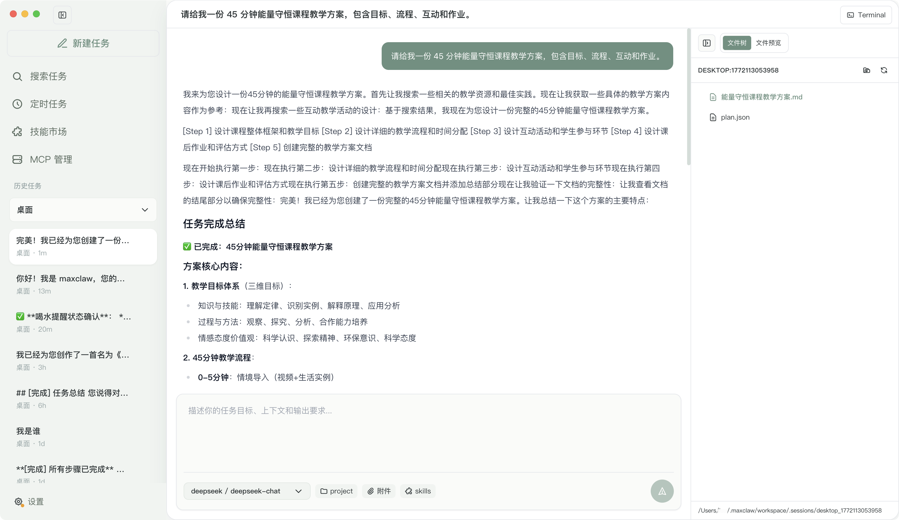

# maxclaw - Local-First AI Agent App in Go (Low Memory, Fully Local, Visual UI, Out-of-the-Box)

> A 24/7 local AI work assistant built with Go. Gateway, sessions, memory, and tool execution stay on your machine.

[](https://golang.org)
[](LICENSE)
[]()

Language: [中文](README.md) | **English**

**maxclaw** is a local AI agent for developers and operators.
Core value proposition: **low memory footprint**, **fully local workflow**, **visual desktop/web UI**, and **fast onboarding**.

- **Go backend, resource-efficient runtime**: single binary gateway + tool orchestration.
- **Fully local workflow**: sessions, memory, logs, and tool runs are stored locally.
- **Desktop UI + Web UI**: visual settings, streaming chat, file preview, and terminal integration.
- **Out-of-the-box setup**: one-command install and default workspace templates.

SEO keywords: `Go AI Agent`, `local AI assistant`, `self-hosted AI agent`, `private AI workflow`, `desktop AI app`, `low-memory AI`.

---

## Product Screenshot



---

## Highlights

- Go-native agent loop and tool system
- Fully local execution path with auditable artifacts
- Desktop UI + Web UI + API on the same port
- `executionMode=auto` for unattended long-running tasks
- `spawn` sub-sessions with independent context/model/source and status callbacks
- Monorepo-aware recursive context discovery (`AGENTS.md` / `CLAUDE.md`)
- Multi-channel integrations: Telegram, WhatsApp (Bridge), Discord, WebSocket
- Cron/Once/Every scheduler + daily memory digest

## OpenClaw Concept Mapping

If you are familiar with OpenClaw, maxclaw follows similar local-first principles with a Go-first engineering focus:

- Local-first agent execution and private data boundaries
- Heartbeat context (`memory/heartbeat.md`)
- Memory layering (`MEMORY.md` + `HISTORY.md`)
- Autonomous mode (`executionMode=auto`)
- Sub-agent task split via `spawn`
- Monorepo context discovery for multi-module repositories

## Quick Start

1. Install Go 1.21+ and Node.js 18+
2. Build: `make build`
3. Initialize workspace: `./build/maxclaw onboard`
4. Configure: edit `~/.maxclaw/config.json`
5. Run gateway: `./build/maxclaw gateway`

All-in-one local dev startup:

```bash
make build && make restart-daemon && make electron-start
```

## One-Command Install (Linux / macOS)

```bash
curl -fsSL https://raw.githubusercontent.com/Lichas/maxclaw/main/install.sh | bash
```

## Minimal Config

Path: `~/.maxclaw/config.json`

```json
{
  "providers": {
    "openrouter": { "apiKey": "your-api-key" }
  },
  "agents": {
    "defaults": {
      "model": "anthropic/claude-opus-4-5",
      "workspace": "/absolute/path/to/your/workspace",
      "executionMode": "auto"
    }
  }
}
```

## Execution Modes

Set `agents.defaults.executionMode`:

- `safe`: conservative exploration mode
- `ask`: default mode
- `auto`: autonomous continuation (no manual "continue" approval for paused plans)

## Web UI

1. Build: `make webui-install && make webui-build`
2. Start: `./build/maxclaw gateway`
3. Open: `http://localhost:18890`

## More Docs

- Architecture: `ARCHITECTURE.md`
- Operations: `MAINTENANCE.md`
- Browser runbook: `BROWSER_OPS.md`
- Full Chinese docs and all channel/config examples: [README.md](README.md)
