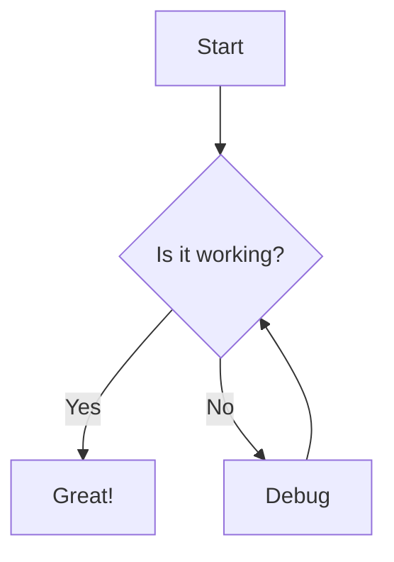

# Mermaid Chart Support Implementation Plan

> **For Claude:** REQUIRED SUB-SKILL: Use superpowers:executing-plans to implement this plan task-by-task.

**Goal:** Add Mermaid diagram rendering support to the Electron App's chat interface, enabling visualization of flowcharts, sequence diagrams, class diagrams, and more.

**Architecture:** Integrate the `mermaid` npm package into the Markdown renderer component. When processing markdown content, detect code blocks with language "mermaid" and render them as SVG diagrams using mermaid's client-side rendering. Support both light and dark themes by dynamically configuring mermaid's theme based on the current UI theme.

**Tech Stack:** mermaid@^10.x, react-markdown, TypeScript, Tailwind CSS

---

## Prerequisites

- Electron app builds successfully: `cd electron && npm run build`
- Gateway is running and accessible at `http://localhost:18890`
- Familiarity with react-markdown component structure in `electron/src/renderer/components/MarkdownRenderer.tsx`

---

### Task 1: Install Mermaid Dependency

**Files:**
- Modify: `electron/package.json`

**Step 1: Install mermaid package**

Run:
```bash
cd /Users/lua/git/nanobot-go/electron
npm install mermaid@^10.9.0
```

Expected: Package installs without errors, package.json updated.

**Step 2: Verify installation**

Run:
```bash
npm list mermaid
```

Expected: Shows `mermaid@10.x.x` in the output.

**Step 3: Commit**

```bash
git add package.json package-lock.json
git commit -m "deps(electron): add mermaid for diagram rendering"
```

---

### Task 2: Create MermaidRenderer Component

**Files:**
- Create: `electron/src/renderer/components/MermaidRenderer.tsx`

**Step 1: Write the component**

```typescript
import React, { useEffect, useRef, useState } from 'react';
import mermaid from 'mermaid';

interface MermaidRendererProps {
  chart: string;
  theme?: 'light' | 'dark';
}

export function MermaidRenderer({ chart, theme = 'light' }: MermaidRendererProps) {
  const containerRef = useRef<HTMLDivElement>(null);
  const [svg, setSvg] = useState<string>('');
  const [error, setError] = useState<string | null>(null);

  useEffect(() => {
    mermaid.initialize({
      theme: theme === 'dark' ? 'dark' : 'default',
      securityLevel: 'strict',
      startOnLoad: false,
    });
  }, [theme]);

  useEffect(() => {
    const renderChart = async () => {
      if (!chart.trim()) return;

      try {
        // Generate unique ID for this chart
        const id = `mermaid-${Math.random().toString(36).substr(2, 9)}`;
        const { svg } = await mermaid.render(id, chart.trim());
        setSvg(svg);
        setError(null);
      } catch (err) {
        setError(err instanceof Error ? err.message : 'Failed to render diagram');
        setSvg('');
      }
    };

    void renderChart();
  }, [chart]);

  if (error) {
    return (
      <div className="rounded-lg border border-red-200 bg-red-50 p-4 dark:border-red-900/50 dark:bg-red-900/20">
        <p className="text-sm text-red-700 dark:text-red-300 font-medium">Diagram Error</p>
        <p className="text-xs text-red-600 dark:text-red-400 mt-1">{error}</p>
        <pre className="mt-2 text-xs text-red-800 dark:text-red-200 bg-red-100 dark:bg-red-900/30 p-2 rounded overflow-x-auto">
          {chart}
        </pre>
      </div>
    );
  }

  return (
    <div
      ref={containerRef}
      className="mermaid-chart my-4 overflow-x-auto rounded-lg border border-border bg-background p-4"
      dangerouslySetInnerHTML={{ __html: svg }}
    />
  );
}
```

**Step 2: Verify file is created**

Run:
```bash
ls -la electron/src/renderer/components/MermaidRenderer.tsx
```

Expected: File exists.

**Step 3: Commit**

```bash
git add electron/src/renderer/components/MermaidRenderer.tsx
git commit -m "feat(electron): add MermaidRenderer component"
```

---

### Task 3: Integrate Mermaid into MarkdownRenderer

**Files:**
- Modify: `electron/src/renderer/components/MarkdownRenderer.tsx`
- Read first: `electron/src/renderer/components/MarkdownRenderer.tsx` (current implementation)

**Step 1: Read current MarkdownRenderer**

Read the file to understand its structure.

**Step 2: Add mermaid code block handling**

Add the MermaidRenderer import and modify the code component:

```typescript
import React from 'react';
import ReactMarkdown from 'react-markdown';
import { Prism as SyntaxHighlighter } from 'react-syntax-highlighter';
import { vscDarkPlus, vs } from 'react-syntax-highlighter/dist/esm/styles/prism';
import { useSelector } from 'react-redux';
import { RootState } from '../store';
import { MermaidRenderer } from './MermaidRenderer';

interface MarkdownRendererProps {
  content: string;
}

export function MarkdownRenderer({ content }: MarkdownRendererProps) {
  const { theme } = useSelector((state: RootState) => state.ui);
  const isDark = theme === 'dark' || (theme === 'system' && window.matchMedia('(prefers-color-scheme: dark)').matches);

  return (
    <ReactMarkdown
      components={{
        code({ node, inline, className, children, ...props }: any) {
          const match = /language-(\w+)/.exec(className || '');
          const language = match ? match[1] : '';

          // Handle mermaid code blocks
          if (language === 'mermaid') {
            return (
              <MermaidRenderer
                chart={String(children).replace(/\n$/, '')}
                theme={isDark ? 'dark' : 'light'}
              />
            );
          }

          if (!inline && language) {
            return (
              <SyntaxHighlighter
                style={isDark ? vscDarkPlus : vs}
                language={language}
                PreTag="div"
                {...props}
              >
                {String(children).replace(/\n$/, '')}
              </SyntaxHighlighter>
            );
          }

          return (
            <code className={className} {...props}>
              {children}
            </code>
          );
        },
      }}
    >
      {content}
    </ReactMarkdown>
  );
}
```

**Step 3: Build and verify no errors**

Run:
```bash
cd /Users/lua/git/nanobot-go/electron
npm run build 2>&1 | tail -20
```

Expected: Build completes without errors.

**Step 4: Commit**

```bash
git add electron/src/renderer/components/MarkdownRenderer.tsx
git commit -m "feat(electron): integrate mermaid rendering into MarkdownRenderer"
```

---

### Task 4: Add Mermaid CSS Styles

**Files:**
- Modify: `electron/src/renderer/styles/globals.css`

**Step 1: Add mermaid chart styles**

Add to the end of globals.css:

```css
/* Mermaid Chart Styles */
.mermaid-chart {
  display: flex;
  justify-content: center;
  align-items: center;
}

.mermaid-chart svg {
  max-width: 100%;
  height: auto;
}

/* Ensure mermaid text is readable in both themes */
.mermaid-chart .node rect,
.mermaid-chart .node circle,
.mermaid-chart .node ellipse,
.mermaid-chart .node polygon {
  stroke-width: 2px;
}

.mermaid-chart .edgeLabel {
  background-color: var(--background);
  color: var(--foreground);
}

/* Dark theme adjustments */
.dark .mermaid-chart {
  background-color: var(--card);
}
```

**Step 2: Build and verify**

Run:
```bash
npm run build 2>&1 | tail -10
```

Expected: Build completes successfully.

**Step 3: Commit**

```bash
git add electron/src/renderer/styles/globals.css
git commit -m "style(electron): add mermaid chart CSS styles"
```

---

### Task 5: Create Test Component

**Files:**
- Create: `electron/src/renderer/components/MermaidRenderer.test.tsx`

**Step 1: Write the test**

```typescript
import React from 'react';
import { render, screen, waitFor } from '@testing-library/react';
import { MermaidRenderer } from './MermaidRenderer';

// Mock mermaid to avoid actual rendering in tests
jest.mock('mermaid', () => ({
  initialize: jest.fn(),
  render: jest.fn().mockResolvedValue({
    svg: '<svg><text>Mocked Diagram</text></svg>',
  }),
}));

describe('MermaidRenderer', () => {
  it('renders mermaid chart', async () => {
    render(<MermaidRenderer chart="graph TD; A-->B;" theme="light" />);

    await waitFor(() => {
      expect(screen.getByText('Mocked Diagram')).toBeInTheDocument();
    });
  });

  it('displays error for invalid syntax', async () => {
    const { render: mockRender } = require('mermaid');
    mockRender.mockRejectedValueOnce(new Error('Syntax error'));

    render(<MermaidRenderer chart="invalid syntax" theme="light" />);

    await waitFor(() => {
      expect(screen.getByText('Diagram Error')).toBeInTheDocument();
    });
  });

  it('applies dark theme when specified', () => {
    const { initialize } = require('mermaid');
    render(<MermaidRenderer chart="graph TD;" theme="dark" />);

    expect(initialize).toHaveBeenCalledWith(
      expect.objectContaining({ theme: 'dark' })
    );
  });
});
```

**Step 2: Verify test file exists**

Run:
```bash
ls -la electron/src/renderer/components/MermaidRenderer.test.tsx
```

**Step 3: Commit**

```bash
git add electron/src/renderer/components/MermaidRenderer.test.tsx
git commit -m "test(electron): add MermaidRenderer tests"
```

---

### Task 6: Manual Testing

**Step 1: Start the application**

Run:
```bash
cd /Users/lua/git/nanobot-go
make build
./build/nanobot-go gateway &
cd electron
npm run dev
```

**Step 2: Test mermaid rendering**

Send a message with mermaid code block:

```markdown
Here's a flowchart:


```

**Step 3: Verify theme switching**

1. Switch to dark theme in Settings
2. Send another mermaid diagram
3. Verify diagram renders with dark theme

**Step 4: Test error handling**

Send invalid mermaid syntax:

```markdown
```mermaid
invalid syntax here
```
```

Verify error message displays correctly.

**Step 5: Stop test environment**

```bash
pkill -f "nanobot-go gateway"
pkill -f "electron"
```

---

### Task 7: Update Documentation

**Files:**
- Modify: `docs/Electron_STATUS.md`
- Modify: `docs/Electron_PRD.md`
- Modify: `CHANGELOG.md`

**Step 1: Update Electron_STATUS.md**

Change:
```markdown
| mermaid | ❌ | 未实现 |
```
to:
```markdown
| mermaid | ✅ | 已集成，支持流程图/时序图/类图等 |
```

**Step 2: Update Electron_PRD.md**

In section 5.1.1, change:
```markdown
- [ ] Mermaid 图表渲染
```
to:
```markdown
- [x] Mermaid 图表渲染（流程图、时序图、类图等）
```

**Step 3: Update CHANGELOG.md**

Add under ## [Unreleased]:

```markdown
#### 新增 Mermaid 图表渲染（`electron/src/renderer/components/MermaidRenderer.tsx`）
- **功能**：聊天界面支持渲染 Mermaid 图表
- **实现**：
  - 新增 `MermaidRenderer` 组件，使用 mermaid@10.x 库
  - 集成到 `MarkdownRenderer`，自动检测 `mermaid` 代码块
  - 支持深色/浅色主题自动切换
  - 错误处理：语法错误时显示友好提示
- **测试**
  - 手动测试流程图、时序图、类图渲染
  - 验证主题切换正确应用
- **文档**
  - 更新 Electron_STATUS.md 和 Electron_PRD.md
```

**Step 4: Commit**

```bash
git add docs/Electron_STATUS.md docs/Electron_PRD.md CHANGELOG.md
git commit -m "docs: update documentation for mermaid chart support"
```

---

## Summary

After completing this plan:
- Mermaid diagrams render correctly in chat messages
- Both light and dark themes are supported
- Invalid syntax shows helpful error messages
- Documentation is updated with the new feature

**Next Priority:** File attachment functionality
